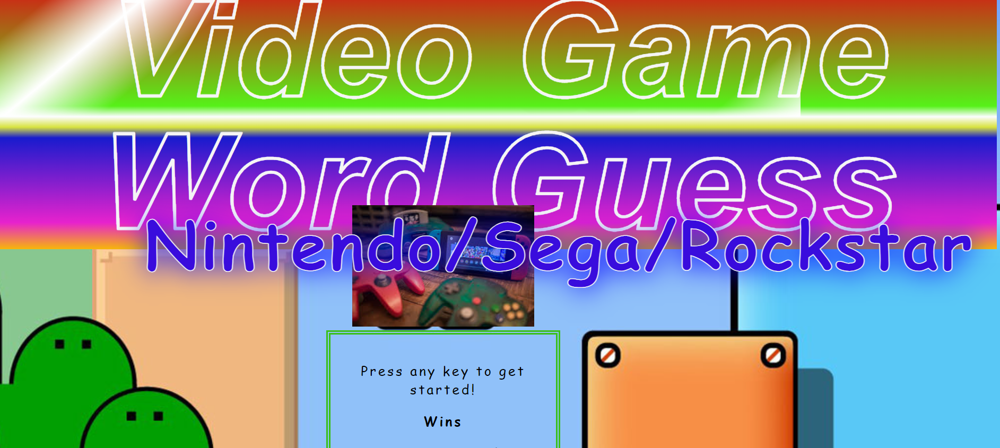
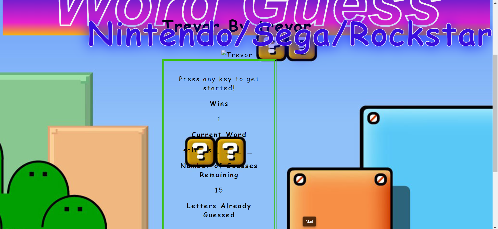

# VideoGameWordGuess
This web application uses an a huge object that has an object within an object.
The huge object has an object in it with thirteen names of random and famous video game characters as stand alone keys. Then there is an object with in that object with three key/value pairs. The key/value pairs include picture, song-name, and song soundbite. The user is tasked with guessing the name of the video game characters, a letter at a time. If the user guesses all the letters of the name the song for that character is played.
test out the website [here](https://ausar1989.github.io/VideoGameWordGuess/)

# Screenshots
Image of the jumbotron:

Image of the box with some correctly guessed letters:

# Technology Used
- HTML
- CSS
- Javascript
